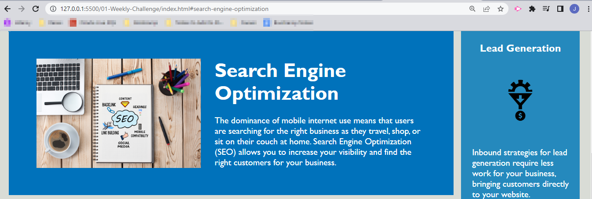

# Horiseon Home Page | 01 Weekly Challenge

## Description

This Horiseon webpage illustrates the services provided by Horiseon. It provides definitions of Search Engine Optimization (SEO), Online Reputation Management, and Social Media Marketing for potential customers to understand how this company's services can be utilized to lead generation, brand awareness, and cost management. 

During the process of this assignment I learned how to consolidate CSS code to be more concise, as well as practicing the github workflow.

This webpage has been deployed at: https://shockeyj9.github.io/horiseon-seo-01challenge/

## Installation

N/A

## Usage

This homepage contains a top navigation bar with links that direct users to different content on the page. User's cursor changes on hover indicating it can be selected as shown below:

Users are then directed to the content associated with that menu link:

## Credits

N/A

## License

Please refer to the LICENSE in the repo.

